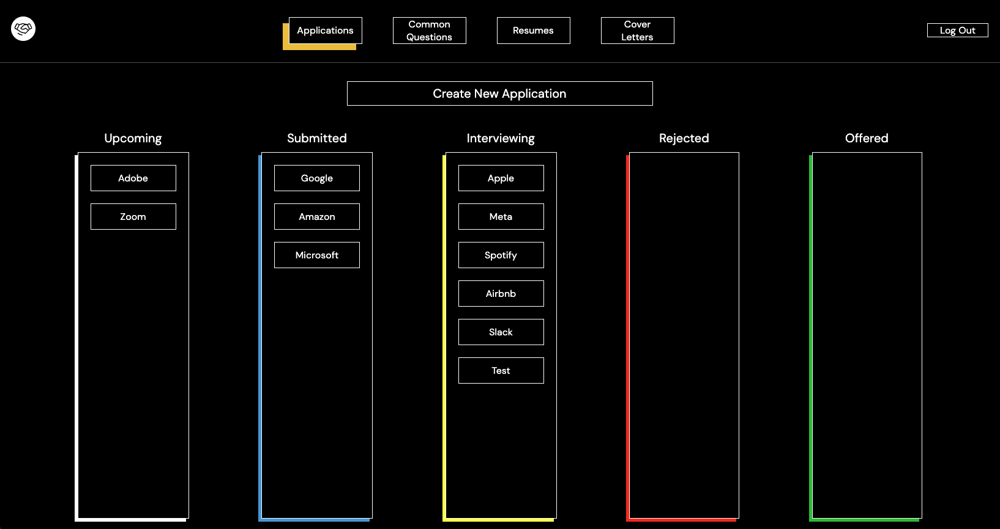
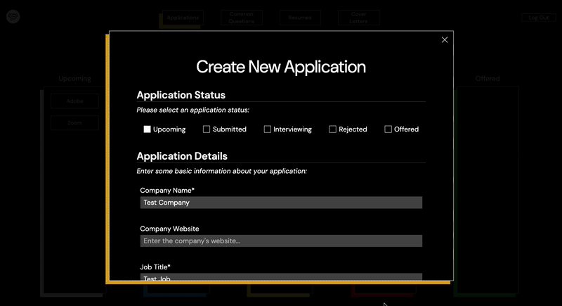
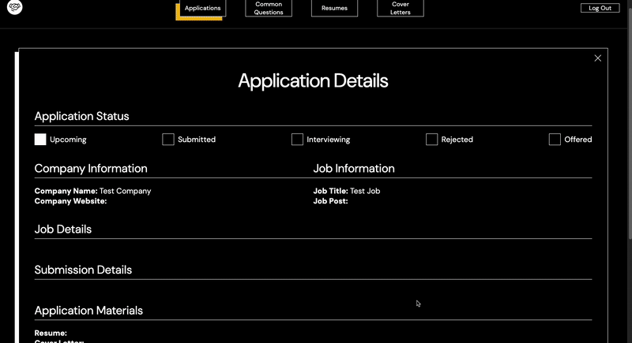

# Welcome to Next Hire

NextHire is an application that helps users manage and track job applications. The app gives users the ability to store important information, deadlines, and application-specific materials for each individual job application, as well as a convenient interface for tracking multiple applications at the same time. In the future, it will also provides ways to store and easily access reusable application components (resumes, cover letters, and common application questions), to make applying to jobs faster and more efficient.

**[🔭 Click here to visit the NextHire website!](https://nexthire-m0no.onrender.com/)**

## Tech Stack

**Frameworks and libraries:** 

        

**Database:** 

 

**Storage:**

**Hosting:**

## Using NextHire

NextHire is a user-based application, meaning prospective users must make an account in order to access its features. There is no content for non-users. 

Making or logging in to a user account is simple and straightforward: simply visit the [homepage](https://nexthire-m0no.onrender.com/) of the website and select "Sign Up" or "Log In". If you would just like to see NextHire's features without creating an account, you can also select "Log In as Demo User" to log in with a fake account. 

### Applications

After logging in, users start on the "Applications" page, where they can see all of their existing applications, and also create new ones. 

Applications are grouped by their application status. This system allows users to quickly grasp where each application stands in the hiring journey.

To create a new application, users click the create new application button:

This opens the Create Application form, where users can enter the specific details of their application. Once created, users will be directed to a new page containing the details of their new application:

From this page, you can use the "Update" button to change your application: 

Or, you can use the "Delete" button to permanently delete the application and its data. 

Or, you can return to the "Applications" page by pressing the "X" at the top of the application:

A few other details from the "Applications" page:

To see an application's details page again, users can click any application on the "Applications" page:

The other core feature of the "Applications" page is the drag and drop functionality. Users can update the application status of each application through the "Update" button, but they can also do this from the "Applications" page by simply dragging an application from one column into another, like so:

This action will automatically update the status of that application!

### Common Questions

At the top of the page, users can click the "Common Questions" button to view the "Common Questions" page. Here, users can store their responses to common job application questions, allowing them to reference and use these responses throughout their applications.

To create a new common question, simply click the "Add Common Question" button, and enter the question and its response. Once created, you will immediately see the question appear in the list:

Clicking a question will allow you to see and update that question:

And pressing the garbage can icon in the corner of a question allows you to delete it:

